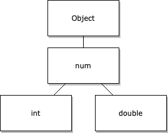

## Variables

In Flutter, variables are used to store values. There are two types of variables in Flutter:

    - local variables: These are declared within a function and are only accessible within that function
    - Instance variables: They are declared within a class and are accessible throughout the entire class.

Variables in Flutter can store values of different data types, such as numbers, strings, booleans, and more.

## Built-in Types

There are several built-in data types, including:

    - int: used to store integers
    - double: used to store floating-point numbers
    - String: used to store text
    - bool: used to store true or false values
    - List: used to store ordered collections of objects
    - Sets: used to store unordered collection of unique items
    - Map: used to store unordered collections of key-value pairs

### Primitive Types

#### Numbers

Dart has three data types for holding numbers:

- num : The equivalent to the generic number type in JavaScript.
- int : A numeric value without a fractional part.
- double: Any 64-bit (double-precision) floating point number.
  
    

As Dart considers numbers as objects, numbers can expose their own utility functions as object methods. You don't need to use an additional object to apply a function to a number.


#### Strings

```var a = 'This is a string.';```

##### Escaping special characters

To include a character with another meaning in a string, like a $ used for string interpolation, you must escape that character. Escaping special characters in Dart works like JavaScript and most other languages. To escape special characters, precede that character with the backslash character (\).

The following code shows some examples.
```
final singleQuotes = 'I\'m learning Dart'; // I'm learning Dart
final doubleQuotes = "Escaping the \" character"; // Escaping the " character
final dollarEscape = 'The price is \$3.14.'; // The price is $3.14.
final backslashEscape = 'The Dart string escape character is \\.';
final unicode = '\u{1F60E}'; // 😎,  Unicode scalar U+1F60E
```
##### String interpolation

JavaScript supports template literals. These use backtick (`) character delimiters for the following reasons:

    To allow for multiline strings
    To interpolate strings with embedded expressions
    To create special constructs called tagged templates

As in JavaScript template literals, you can use the ${<expression>} syntax to insert expressions into a string literal. Dart uses this syntax and allows you to omit the curly braces when the expression uses a single identifier.

        ```
        var food = 'bread';
        var str = 'I eat $food'; // I eat bread
        var str = 'I eat ${food}'; // I eat bread ```

#### Booleans
Boolean values in both Dart and Javascript express a binary condition. These two values represent whether a value or expression is true or false. You can return the values using the literals true and false, or produced them using expressions like x < 5 or y == null.

    var isBananaPeeled = false;
#### Variables
Variables in Dart work like variables in JavaScript, with two exceptions:

- Each variable has a type.
- Dart scopes all variables at the block level, like let and const variables in JavaScript.

A Dart variable gets its type in one of two ways:

- Declared: A type written in the declaration.
- Inferred: An expression used to initialize the variable. By convention, use var or final when the analyzer can infer the type.

        // Declare a variable with a specific type
        // when you don't provide an initial value
        String name;
        // Declare and initialize a variable
        // at the same time and Dart infers
        // the type
        var name = 'bob';

          // Declare a variable without a type or assigned value
        // and Dart infers the 'dynamic' type
        var name;
        // Initialize the variable and the type remains `dynamic`
        name = 'bob';
        name = 5; // Allowed, as `name` has type `dynamic`.
#### Final and const

When Dart uses const, it refers to special values that it creates when compiling. Dart uses limited expressions to create these immutable values. These expressions cannot have side effects. Under these conditions, the compiler can then predict the precise value of a constant variable or expression, not just its static type.

        final String name;
        // Cannot read name here, not initialized.
        if (useNickname) {
          name = "Bob";
        } else {
          name = "Robert";
        }
        print(name); // Properly initialized here.
        
In Dart, constant variables must contain constant values. Non-constant variables can contain constant values that you can also mark as const.

    var foo = const [];
      // foo is not constant, but the value it points to is.
      // You can reassign foo to a different list value,
      // but its current list value cannot be altered.
    
    const baz = []; // Equivalent to `const []`
